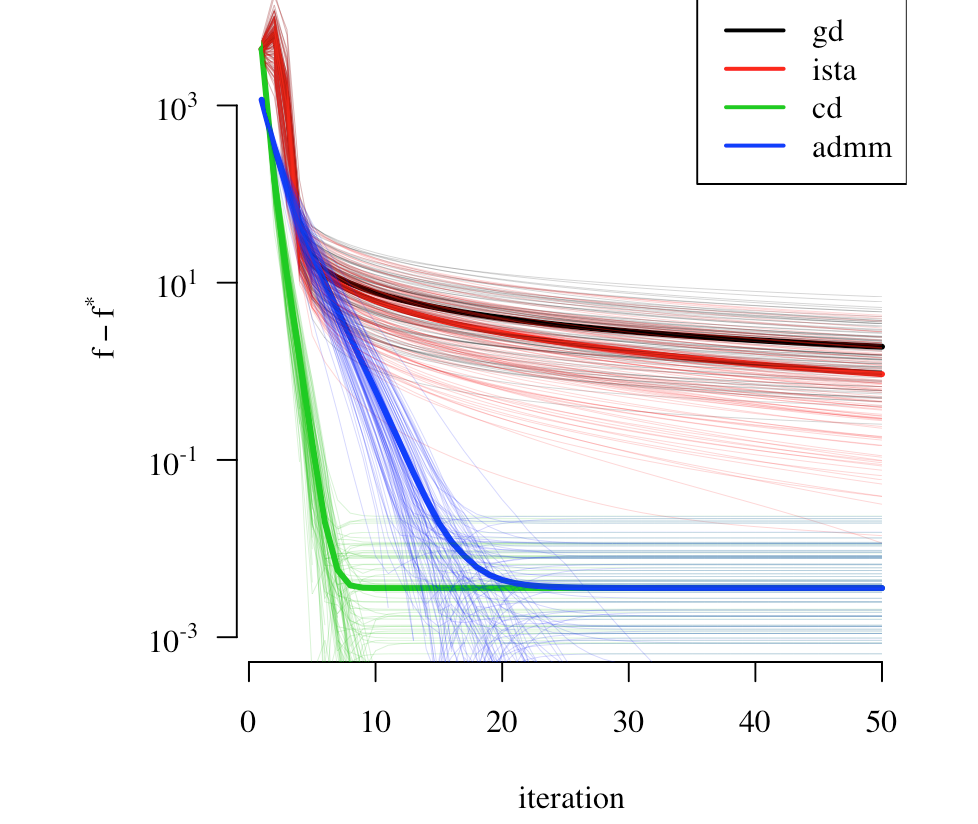

# Convex sets and functions.

During class (Lecture 3), I claimed that the following set is convex:
\[
C = \{x\in\R^k : x_1 A_1 + \cdots + x_k A_k \preceq B \} 
\]
where $A_1,\ldots,A_k,B$ are $n\times n$ symmetric matrices. Prove this result using the definition of a convex set.

# Duality.

a. Derive the dual of a general LP (note the solution in the notes):
\[
\begin{aligned}
\min_x &\quad c^\top x\\
\mbox{subject to} &\quad Ax=b\\
  &\quad Gx \leq h.
\end{aligned}
\]

b. Consider the simpler LP
\[
\begin{aligned}
\min_x &\quad c^\top x\\
\mbox{subject to} &\quad Ax=b\\
  &\quad x \geq 0,
\end{aligned}
\]
along with the related problem
\[
\begin{aligned}
\min_x &\quad c^\top x-\tau\sum_i \log(x_i)\\
\mbox{subject to} &\quad Ax=b.
\end{aligned}
\]
The second version is sometimes called the log barrier function, and acts as a 'soft' inequality constraint, because it will tend to positive infinity as any of the $x_i$ tend to zero from the right. Throughout, assume that $\{x : x > 0,\ Ax = b\}$ and $\{y : A^\top y > -c\}$ are non-empty. i.e. the primal LP and its dual are both strictly feasible.

    i. Derive the dual and the KKT conditions for the original problem.
    ii. Derive the dual and the KKT conditions for the log barrier problem.
    iii. Describe the differences in the two KKT conditions. (Hint: what can you observe about the second set of KKT conditions when $\tau$ is taken to be large?)
    


# Algorithms.

Recall the lasso problem:
\[
\min_\beta \frac{1}{2}\norm{y-X\beta}_2^2 + \lambda \norm{\beta}_1.
\]
Use any programming language you like to implement the following tasks.

1. Generate data. Let $X\in\R^{n\times p}$ consist of iid entries from a normal distribution with mean 0 and variance 1. Take $n=100$ and $p=25$. Set $\beta=(5,5,5,0,\ldots,0)$ and let $y=X\beta+\epsilon$ with $\epsilon$ containing iid entries with mean 0 and variance 0.1. To do this in `R` to match my solutions use

```{r, eval=FALSE}
set.seed(20170926)
n = 100
p = 25
sig = 0.1
beta = c(5,5,5,rep(0,p-3))
X = matrix(rnorm(n*p),nrow=n)
epsilon = rnorm(n,sd=sig)
y = X %*% beta + epsilon
```

2. Estimate the lasso using the following four techniques: (a) subgradient descent, (b) proximal gradient descent (here, this is called ISTA  for Iterated Soft Thresholding Algorithm), (c) coordinate descent, and (d) ADMM. For each method, track $f$ for 50 iterations. 

3. Repeat (1) and (2) 100 times.

4. Produce a plot with the iterations on the $x$-axis and $\log_{10}(f-f^*)$ on the $y$-axis. You should plot all 400 lines (thin) as well as the mean of each method (thick). My result is shown below so that this is clear.



Notes: It is useful to precompute $X^\top X$, $X^\top y$, and $y^\top y$. For subgradient descent and ISTA, I suggest $t_0=0.015$. In ADMM, take $\rho=100$. Total computation time for me was under 10 seconds.
